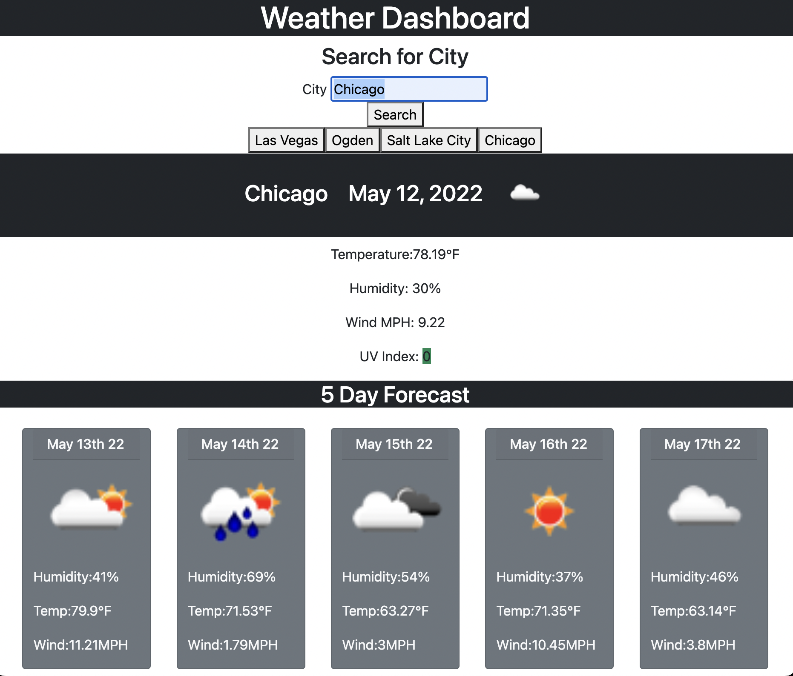

# Weather-Dashboard
## Purpose
Purpose of this weather app is so that users can search a city and get the current and 5 day weather forecast associated with that city. Users recent searches will be saved with local storage and they will be able to select those recent searches and see the forecast as well. The UV index changes colors depending on severity.
## Built With
* HTML
* JS
## Moving Forward
I would look like to make it more visually appealing
## Lessons Learned
How use an API with fetch request
## Resources
I got help from my tutor, TA's, & classmates
### Web link:
- Live Link [website](https://vhivestate.github.io/Weather-Dashboard/)
## Screenshot

## Contribution
Made with ❤️ by Valeria Garcia